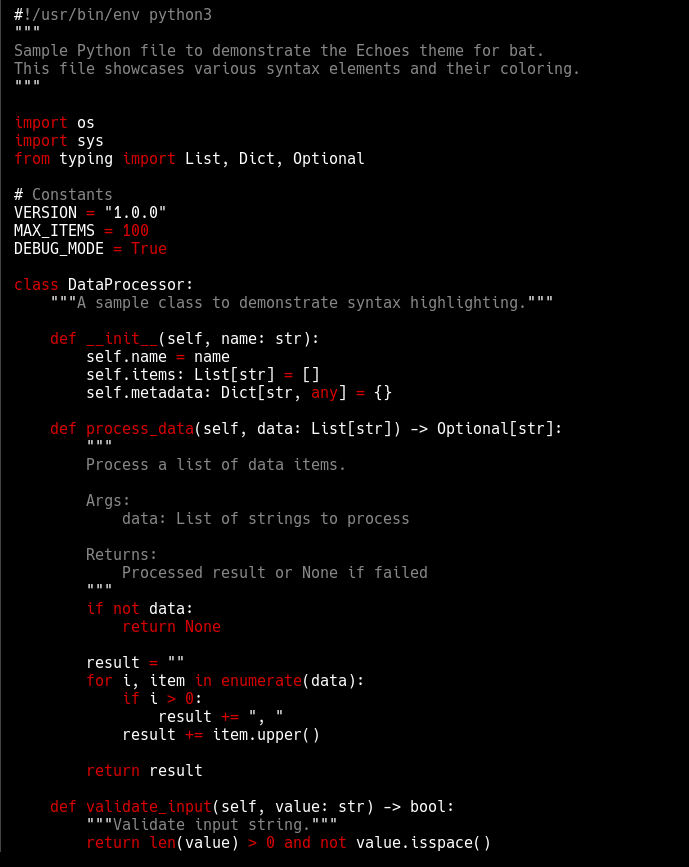

# Echoes Theme for Bat

A minimalist dark theme for `bat` using only **red**, **white**, and **grey** colors.



## Status

**🚧 Work in Progress**

This theme is currently under development and being refined for optimal syntax highlighting.

## Features

- **Pure black background** (`#000000`)
- **Three-color palette**: Red, white, and grey only
- **Optimized for Python and JSON** with specific syntax highlighting
- **Clear visual distinction** between keys and values in JSON
- **Italic comments** for better code distinction
- **Your favorite red** (`#d70000` - ANSI 256-color 160)

## Installation

### Quick Install

```bash
./install.sh
```

### Usage

```bash
# One-time use
bat --theme=Echoes <filename>

# Permanent usage (add to your shell profile)
export BAT_THEME="Echoes"
```

## Color Scheme

### JSON Files
- **Keys**: White (`#ffffff`)
- **String Values**: Grey (`#aaaaaa`)
- **Numbers**: Dark Red (`#cc0000`)
- **Booleans**: Bright Red (`#ff0000`)

### Python Files
- **Comments**: Grey (`#888888`, italic)
- **Strings**: White (`#ffffff`)
- **Keywords/Functions**: Red (`#d70000`)
- **Variables/Classes**: White (`#ffffff`)

## Requirements

- `bat` (https://github.com/sharkdp/bat)
- Terminal with truecolor support